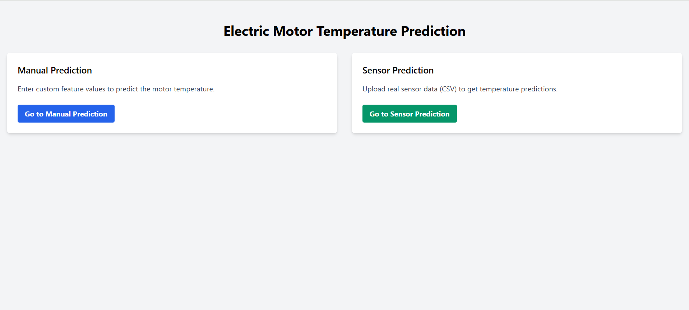
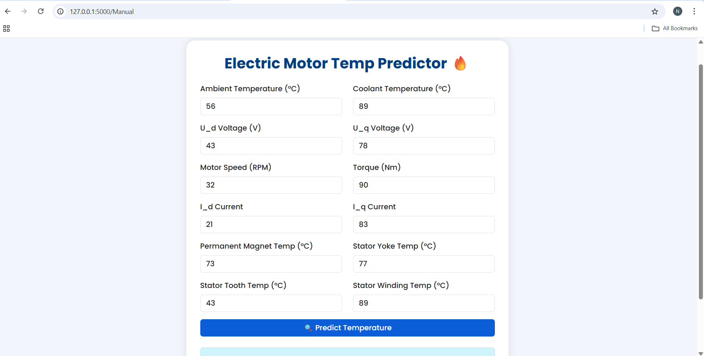
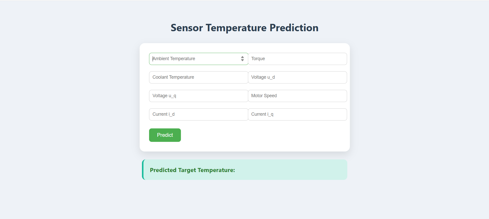

# Electric Motor Temperature Prediction Using Machine Learning

## 📌 Project Overview
Electric motors are critical components in industrial and automation systems. Overheating can lead to reduced efficiency and unexpected failures.  
This project uses Machine Learning techniques to predict the operating temperature of an electric motor based on sensor data, enabling early fault detection and predictive maintenance.

## 🎯 Objectives
- Predict electric motor temperature accurately using ML models  
- Prevent overheating and sudden motor failures  
- Improve motor efficiency and lifespan  
- Support predictive maintenance strategies  

## 🤖 Machine Learning Models Used
- Linear Regression  
- Decision Tree  
- Random Forest  
- Support Vector Machine (SVM)  

## 🛠 Technologies Used
- Programming Language: Python  
- Machine Learning: Scikit-learn, NumPy, Pandas  
- Web Interface: HTML, CSS  
- Backend: Flask  
- Visualization: Matplotlib / Seaborn  

## 📁 Project Structure
Electric Motor Temperature Prediction/
│
├── Code/
│   ├── index.html
│   ├── sensor.html
│   └── Manual.html
│
├── Main/
│   ├── app.py
│   ├── train_model.py
│   └── sensor_model_train.py
│
├── Output/
│   ├── Home.png
│   ├── Manual.png
│   ├── Sensor.png
│   └── Prediction_Result.png
│
└── README.md
## ▶ How to Run the Project
1. Install required libraries:
pip install -r requirements.txt

2. Run the Flask application:
python app.py

3. Open browser and go to:
http://127.0.0.1:5000

## 📸 Screenshots

### Home Page

### Manual Prediction

### Sensor Prediction

### Prediction Result

## 🚀 Applications
- Industrial motor monitoring  
- Predictive maintenance systems  
- Electric vehicles  
- Smart manufacturing  
- Automation industries  

## 🔮 Future Enhancements
- Real-time sensor data integration  
- Cloud-based deployment  
- Advanced deep learning models  
- Live dashboards and analytics  

## 🏁 Conclusion
This project demonstrates how Machine Learning can be effectively used to predict electric motor temperature, helping industries prevent failures, reduce downtime, and improve operational efficiency.
